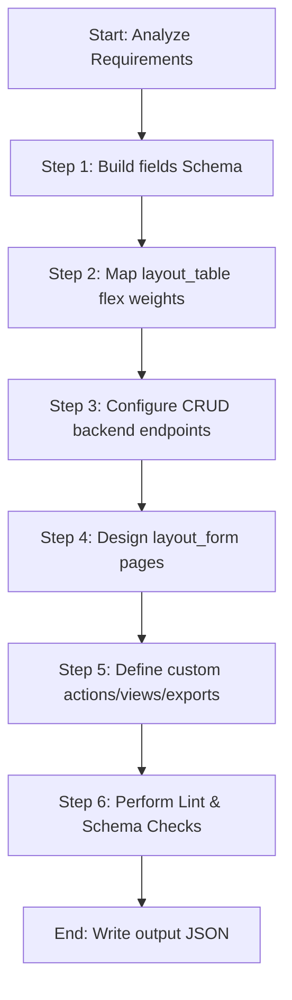

# Agent Skill: generate_json

This skill guides the generation, editing, validation, and maintenance of dynamic entity JSON configuration files for the no-code Flutter framework. 

---

## 1. Context & Objective
In this project, data models, list views, forms, backend API bindings, workflows, print layouts, and security rules are defined dynamically via JSON files stored under:
`asset/configuration/entity/<entity_id>.json`

Your goal is to parse requirements and generate/edit complete, well-formed, and semantic entity configurations that integrate flawlessly with the dynamic Flutter renderer.

---

## 2. Core Rules & Design Constraints
1. **Filename Match**: The file name must match the top-level `"id"` field exactly (e.g. `banks.json` -> `"id": "banks"`).
2. **Snake Case Keys**: All JSON object keys must be snake_case.
3. **Reference Integrity**: 
   - Every `id` inside `layout_form` components or `fields` in `layout_form.groups` rows must match a valid `reference` defined in `fields`.
   - Every column key in `layout_table` must correspond to a valid `reference` defined in `fields`.
   - Action form and print bindings (`layout_form_id`, `layout_print_id`) must refer to existing items in `layout_form` or `layout_print` respectively.
4. **Column Flex Balance**: The sum of column weights in `layout_table` should target approximately **24** for a clean, balanced layout on standard screens.
5. **No Trailing Commas**: JSON must be valid and conform to strict syntax standards.

---

## 3. Schema Specification & Parameters

### 3.1. Top-Level Properties
| Property | Type | Required | Description |
|---|---|---|---|
| `id` | String | Yes | Unique identifier for the entity (must match the filename). |
| `label` | String | Yes | Human-readable singular name displayed in the UI. |
| `description` | String | Yes | Brief description of the entity. |
| `fields` | Array | Yes | List of fields defining the data schema (see [Fields Section](#32-entity-fields)). |
| `layout_table` | Map | Yes | Field references mapped to column flex weights (target sum ~24). |
| `backend` | Object | Yes | CRUD HTTP endpoint configurations (see [Backend Section](#33-backend-crud)). |
| `layout_form` | Array/Object | No | Form layouts for create, update, detail, or custom views. |
| `layout_list_tile` | Object | No | Custom list item tiles (e.g. `{"title": "name", "subtitle": "desc"}`). |
| `views` | Array | No | Defines related child entities/views. |
| `exports` | Array | No | Defines reports export endpoints (xlsx, csv, pdf). |
| `actions` | Array | No | Row/list level actions (see [Actions Section](#36-actions)). |
| `actions_home` | Array | No | Actions displayed on the home page/dashboard. |
| `action_primary` | Object | No | Primary Floating Action Button (FAB) configuration. |
| `filters` | Array | No | List of field references or configuration maps to render in search/filter bars. |
| `bypass_all_permissions`| Boolean | No | Bypasses permission checks (defaults to `true` if omitted). |

---

### 3.2. Entity Fields (`fields`)
Each field represents a property of the data model.

```json
{
  "label": "Full Name",
  "reference": "name",
  "type": "text",
  "column_width": 150.0,
  "auto_generated": false,
  "required": true,
  "pattern": "^[a-zA-Z0-9 ]{3,}$",
  "pattern_error": "Name must be alphanumeric and at least 3 characters",
  "min_length": 3,
  "max_length": 255,
  "allow_create": true,
  "allow_update": true,
  "is_copyable": true
}
```

#### Supported Field Types
- `text`: Standard alphanumeric text field.
- `number`: Standard numeric field. Supports decimals via parameter: `number(<decimal_places>)` (e.g., `number(2)`).
- `bool`: True/False values.
- `date` or `datetime(<format_string>)`: Date & times. Default format is `yyyy-MM-dd HH:mm:ss`.
- `permission`: Security permission select.
- `select`: Dropdown choice. Requires defining lookup source in `options_source`.

#### Option & Lookup Bindings (`options_source`)
Dropdowns can bind to static key-values or dynamic entities.
1. **Static Values**:
   `"options_source": "values('PRIORITY':'Priority','EXPRESS':'Express','REGULAR':'Regular')"`
2. **Dynamic Backend Source**:
   `"options_source": "backend.<entity_id>({<key>}:{<label>})[?query]"`
   - *Example*: `"backend.bank_type({id}:{name})"`
   - *Example with static query parameters*: `"backend.staff({id}:{full_name})?status.eq=ACTIVE"`
   - *Example with parent context placeholders*: `"backend.marketings({code}:{name})?position.eq=SPV&parent_nip.eq={page[0].subordinate_nip}"` (replaces `{page[index].fieldPath}` with the runtime values from parent pages).

---

### 3.3. Backend CRUD Configuration
Define HTTP methods and endpoints. Base URL placeholder `{backend_host}` is resolved at runtime.

```json
"backend": {
  "read_all": {
    "method": "GET",
    "url": "{backend_host}/items"
  },
  "read": {
    "method": "GET",
    "url": "{backend_host}/items/{id}"
  },
  "create": {
    "method": "POST",
    "url": "{backend_host}/items"
  },
  "update": {
    "method": "PUT",
    "url": "{backend_host}/items/{id}"
  },
  "delete": {
    "method": "DELETE",
    "url": "{backend_host}/items/{id}"
  }
}
```

---

### 3.4. Form Layouts (`layout_form`)
Forms define layouts for data collection, modification, or viewing. You can specify form layouts using one of **three** styles:

#### Style A: Shorthand Grid-Row Layout (Recommended for CRUD forms)
This layout groups fields into rows. Each row maps to a specific number of columns.
```json
"layout_form": [
  {
    "name": "create",
    "groups": [
      {
        "id": "11111111-1111-1111-1111-111111111111",
        "title": "General Information",
        "rows": [
          {
            "columns": 1,
            "fields": ["name"]
          },
          {
            "columns": 2,
            "fields": ["period_start", "period_end"]
          }
        ]
      }
    ]
  }
]
```

#### Style B: Comma-Separated Key-Value Layout (Compact CRUD form representation)
A compact layout style matching comma-separated fields directly to column weights.
```json
"layout_form": {
  "create": {
    "CREATE": {
      "customer_id,outlet_id": 2,
      "product_id": 1,
      "discount_percent,qty": 2
    }
  }
}
```

#### Style C: Dynamic Component-based Layout (For complex dashboards/forms)
Useful for building fully custom dashboards, charts, tables, and nested components.
```json
"layout_form": [
  {
    "id": "bank_form",
    "label": "Bank Details",
    "components": [
      {
        "id": "name",
        "type": "text_field",
        "label": "Bank Name",
        "required": true
      }
    ],
    "submit_workflow": { ... }
  }
]
```
- **Supported Component Types**: `column`, `row`, `container`, `text_field`, `number_field`, `date_picker`, `time_field`, `checkbox`, `switch`, `radio`, `dropdown`, `dropdown_multi_value`, `table`, `list_view`, `text`, `field_display`, `image`, `divider`, `file_picker`, `donut_chart`, `pie_chart`, `bar_chart`, `conditional`.

---

### 3.5. Submit & OnInit Workflows (`submit_workflow` / `on_init`)
Workflows execute sequences of actions synchronously on form initialization or submission.

#### Submit Workflow Properties
- `lock_ui_while_submitting` (Boolean, default: `true`): Locks the form UI during submission.
- `submit_label` (String, optional): Custom submit button text.
- `show_submit_button` (Boolean, default: `true`): Toggles submit button visibility.
- `actions` (Array): Sequential actions to perform.
- `on_success` (Array, optional): Actions to run if main workflow succeeds.
- `on_error` (Array, optional): Actions to run if main workflow encounters an error.

#### Supported Workflow Actions
- **Validate** (`validate`): Validates input state.
  ```json
  { "type": "validate", "scope": "all" }
  ```
- **Stop Workflow** (`stop_workflow`): Halts execution.
  ```json
  { "type": "stop_workflow" }
  ```
- **Set Variable** (`set_var`): Sets a variable in the workflow context.
  ```json
  { "type": "set_var", "key": "my_val", "value": "hello" }
  ```
- **Append Variable** (`append_var`): Appends a value to a list.
  ```json
  { "type": "append_var", "key": "items_list", "value": "{{ current.name }}" }
  ```
- **Toast Notification** (`toast`): Triggers a transient alert message.
  ```json
  { "type": "toast", "variant": "success", "message": "Save successful!" }
  ```
- **Close Modal** (`close_modal`): Closes the current modal or page.
  ```json
  { "type": "close_modal" }
  ```
- **Refresh** (`refresh`): Refreshes a component or table.
  ```json
  { "type": "refresh", "target": "banks_table" }
  ```
- **HTTP Request** (`http`): Performs API request.
  ```json
  {
    "type": "http",
    "name": "Submit API",
    "http": {
      "method": "POST",
      "url": "{backend_host}/submit",
      "body": { "id": "{{ current.id }}" }
    },
    "save_result_to": "api_response"
  }
  ```
- **Condition (If-Then-Else)** (`condition`): Branching logic evaluation.
  ```json
  {
    "type": "condition",
    "if": "{{ current.status == 'ACTIVE' }}",
    "then": [ ... ],
    "else": [ ... ]
  }
  ```
- **Loop** (`loop`): Iterates over array elements.
  ```json
  {
    "type": "loop",
    "items": "{{ vars.api_response.items }}",
    "item_var": "item",
    "actions": [ ... ]
  }
  ```
- **Try Catch** (`try_catch`): Captures errors and saves details to `last_error` and `last_error_stacktrace`.
  ```json
  {
    "type": "try_catch",
    "try": [ ... ],
    "catch": [ ... ]
  }
  ```
- **Export** (`export`): Exports data.
  ```json
  {
    "type": "export",
    "format": "xlsx",
    "dataSource": "my_table",
    "columns": [
      { "header": "Name", "body": "{name}", "width": 100.0 }
    ]
  }
  ```

---

### 3.6. Actions (`actions` / `actions_home` / `action_primary`)
Actions represent entity and row-level operations.

```json
{
  "id": "approve_request",
  "type": "http",
  "name": "Approve",
  "confirm_title": "Approve Confirmation",
  "confirm_message": "Are you sure you want to approve this?",
  "http": {
    "method": "POST",
    "url": "{backend_host}/requests/{id}/approve",
    "body": { "status": "APPROVED" }
  },
  "on_success": ["toast", "refresh"],
  "on_failure": ["toast"]
}
```

#### Action Types (`type`)
- `print`: Renders a PDF template identified by `layout_print_id`.
- `create`: Navigates to a create page.
- `open_page` / `show_dialog`: Opens form defined by `layout_form_id`.
- `list_json_view_as_table`: Renders a raw JSON list field as a data table (requires `reference` key).
- `http`: Performs network request.
- `toast`: Triggers snackbar notification.
- `refresh`: Refreshes data context.
- `navigate_back`: Pops screen.
- `navigate_home`: Routes back to dashboard.
- `export`: Downloads csv/excel data.
- `show_confirmation_dialog`: Triggers verification modal.
- `show_success_dialog_with_data`: Displays a custom success modal with copyable values (requires `success_title`, `success_message`, `copy_label`, `copy_value`).

---

## 4. Workflows for Creating/Editing Configurations



### Step 1: Design fields
List all entity attributes. Check and define validation patterns where appropriate:
- *Phone*: `^0[0-9]{9,13}$`
- *Email*: `^[a-zA-Z0-9._%+-]+@[a-zA-Z0-9.-]+\.[a-zA-Z]{2,}$`
- *Date String*: `^\d{4}-\d{2}-\d{2}$`

### Step 2: Establish Layout Table Weights
Identify which fields are visible in the tabular list. Assign relative weights. Sum of weights should be around 24.
*Example layout_table configuration*:
```json
"layout_table": {
  "id": 4,
  "name": 12,
  "created_at": 8
}
```

### Step 3: Implement Backend Routes
Ensure HTTP methods mapping: `read_all` (GET), `read` (GET), `create` (POST), `update` (PUT), `delete` (DELETE). Make sure query filter mappings are correct (e.g. `{backend_host}/items?id.eq={id}`).

### Step 4: Construct Forms
Decide form layout style (Style A, B, or C). Map fields carefully. Mark mandatory attributes with `"required": true`.

### Step 5: Check Actions and Workflows
Double-check if lookups/dropdowns are resolved. Ensure workflows match component ids.

### Step 6: Validate JSON Syntax
Verify brackets, trailing commas, and formatting before outputting to `asset/configuration/entity/<entity_id>.json`.

---

## 5. Templates & Reference Configurations
For reference, use the existing boilerplate and complete implementation in the workspace:
- **Boilerplate Template**: [entity_template.json](file:///Users/suhal/Documents/Development/projects/vneu/flx_studio/packages/flx_nocode_flutter/.agents/skills/generate_json/resources/entity_template.json)
- **Reference Example (Bank)**: [bank_example.json](file:///Users/suhal/Documents/Development/projects/vneu/flx_studio/packages/flx_nocode_flutter/.agents/skills/generate_json/examples/bank_example.json)
- **Reference Example (Complex Header & Excel Export)**: [incentive_header.json](file:///Users/suhal/Documents/Development/projects/vneu/flx_studio/packages/flx_nocode_flutter/asset/configuration/entity/incentive_header.json)
- **Reference Example (Shorthand Layout Form)**: [estimation.json](file:///Users/suhal/Documents/Development/projects/vneu/flx_studio/packages/flx_nocode_flutter/asset/configuration/entity/estimation.json)
